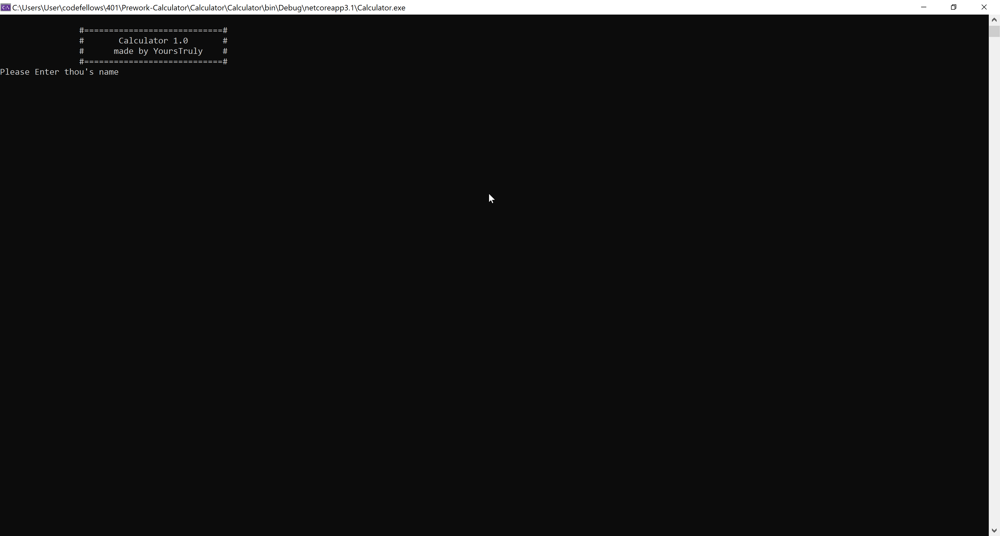
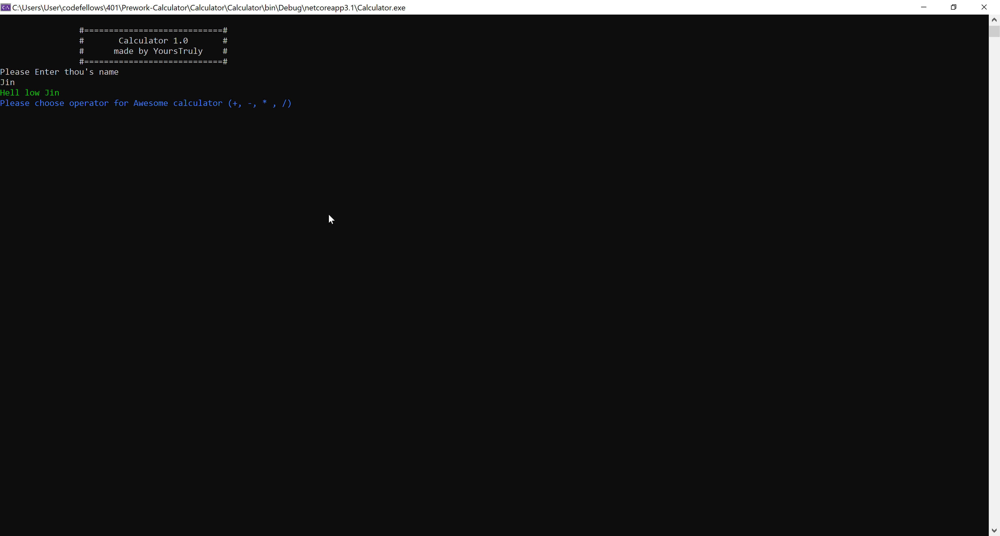
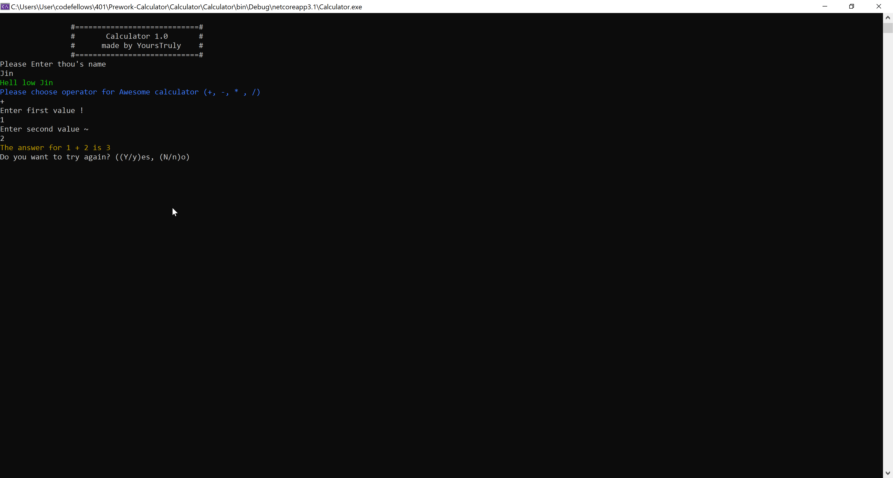

# Prework-Calculator
This application is design to allow user to compute numbers in operator of their choice.

**Author: Jin Kim**

## How to Run

Clone this repo and run this application in root foler -> Calculator -> Calculator folder. Thereafter type in `dotnet run` in the terminal. Then will ask user's name followby operator of their choice (+, -, *, /). Upon entering the opeator, user will give two sets of numerical values then console app will compute the final answer.

## Screenhot

Enter user name screen.

Enter operator screen.

Play again screen

